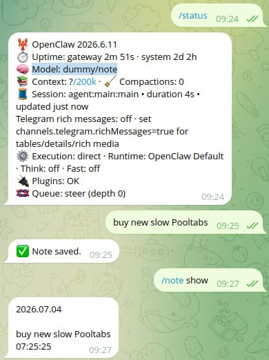

# NOTE

NOTE captures notes deterministically without an LLM call.

## Python runtime

NOTE requires Python and the packages listed in `requirements.txt`. Its bootstrap first uses an
available `python3` and tries `pip` when dependencies are missing; if no usable Python environment
is available, it installs `uv` locally, creates `.venv`, and installs Python and the requirements
without requiring root access.

## Normal AI operation

- `/note <text>` stores a note independently of the active AI model.
- `/note show` displays all notes.
- `/note show 48h` displays notes from the last 48 hours.
- Notes can use Markdown files, SQLite, MariaDB, or PostgreSQL.

## Full mode: patched non-AI operation

Full mode combines the [deterministic OpenClaw patch](https://github.com/safrano9999/openclaw/releases/latest),
the NOTE plugin, and the `dummy/note` model. Every normal non-command message is stored directly
as a note without an LLM call; slash commands are never stored. `dummy/dummy` remains the general
deterministic gateway model without note capture.



### Enable full mode

Apply the latest verified deterministic patch:

```bash
curl -fsSL https://raw.githubusercontent.com/safrano9999/SCRIPTS/main/safrano9999/image/services/openclaw/openclaw-patch-deterministic.sh | bash
```

Download, verify, and install the latest NOTE plugin ZIP:

```bash
tmp="$(mktemp -d)"
curl -fsSL https://github.com/safrano9999/NOTE/releases/latest/download/note-latest.zip -o "$tmp/note-latest.zip"
curl -fsSL https://github.com/safrano9999/NOTE/releases/latest/download/note-latest.zip.sha256 -o "$tmp/note-latest.zip.sha256"
(cd "$tmp" && sha256sum -c note-latest.zip.sha256)
openclaw plugins install --force --dangerously-force-unsafe-install "$tmp/note-latest.zip"
rm -rf "$tmp"
```

Add both deterministic models to the existing model catalog, enable direct NOTE handling, and
select full mode:

```bash
models="$(openclaw config get agents.defaults.models --json 2>/dev/null || printf '{}\n')"
models="$(jq -c 'if type == "object" then . else {} end | . + {"dummy/dummy": {}, "dummy/note": {}}' <<<"$models")"
openclaw config set agents.defaults.models "$models" --strict-json
openclaw config set plugins.entries.note.hooks.allowConversationAccess true --strict-json
openclaw models set dummy/note
```

Optional CLI or webhook triggers can process a note after it has been stored.
