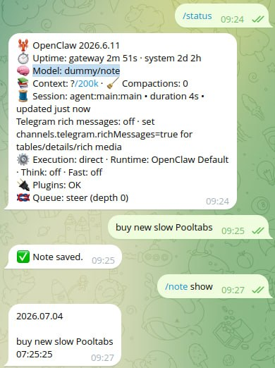

# NOTE

Deterministic note capture with an optional OpenClaw integration.

> **Type:** standalone Python storage engine plus OpenClaw plugin
>
> **AI use:** none for storage, listing, or routing
>
> **OpenClaw-only functionality:** `/note`, direct `dummy/note` handling, and channel feedback
>
> **Hermes integration:** not included; this repository contains no Hermes plugin

NOTE stores text and inbound assets without sending their contents to a model. It
can write daily Markdown files or use SQLite, MariaDB, or PostgreSQL. OpenClaw is
the primary chat interface, while the underlying JSON-over-stdin Python entry
point can also be used directly.

## Features

- Deterministic `/note <text>` capture through OpenClaw.
- `/note show` and `/note show <hours>h` history views.
- Optional direct capture of ordinary messages with the `dummy/note` model.
- Markdown, SQLite, MariaDB, and PostgreSQL storage backends.
- Inbound media, contacts, and locations stored alongside note metadata.
- Optional post-save webhook or shell-command trigger for text-only notes.
- File locking and an `fsync` before a Markdown write is acknowledged.
- No LLM request, embedding, classifier, or token use in the storage path.

## Supported deployment modes

| Mode | Status | What is provided |
| --- | --- | --- |
| Bare metal | Supported for the storage core | `note/store.py` accepts JSON on standard input and returns JSON. There is no standalone chat UI or daemon. |
| OpenClaw | Supported; primary integration | Plugin commands, direct `dummy/note` capture, channel feedback, and plugin release ZIP. |
| Hermes | Not included | No Hermes plugin, hook, or Hermes-specific entry point exists in this repository. |

## Releases

- [Latest release](https://github.com/safrano9999/NOTE/releases/latest)
- [Download `note-latest.zip`](https://github.com/safrano9999/NOTE/releases/download/latest/note-latest.zip)
  · [SHA-256](https://github.com/safrano9999/NOTE/releases/download/latest/note-latest.zip.sha256)

The ZIP is an **OpenClaw plugin archive**. It is produced by GitHub Actions from
a tagged source revision and is not a generic application bundle. Bare-metal
users should clone the source repository instead.

## Bare-metal installation

Requirements are Python 3 and either `curl` or `wget` if the bootstrap needs to
install `uv`.

```bash
git clone --depth 1 https://github.com/safrano9999/NOTE.git
cd NOTE
python="$(./scripts/setup-python.sh)"
cp env.example .env
cp config.conf_example config.conf
```

Edit `.env` and `config.conf`, then pass one JSON request to the storage engine:

```bash
NOTE_DB_BACKEND=file \
NOTE_PATH="$HOME/Notes/Inbox" \
"$python" note/store.py <<JSON
{
  "action": "save",
  "message": "A deterministic note",
  "workspace": "$HOME",
  "channel": "cli",
  "account_id": "",
  "sender_id": "",
  "message_id": ""
}
JSON
```

Read all notes:

```bash
NOTE_DB_BACKEND=file \
NOTE_PATH="$HOME/Notes/Inbox" \
"$python" note/store.py <<JSON
{"action":"show","workspace":"$HOME"}
JSON
```

The direct interface is intentionally small. Supported actions are `save`,
`show`, `command`, and `trigger`; OpenClaw supplies the richer chat and channel
context.

## OpenClaw installation

OpenClaw plugin API and gateway version `2026.6.10` or newer are required.

```bash
tmp="$(mktemp -d)"
trap 'rm -rf "$tmp"' EXIT
curl -fsSL \
  https://github.com/safrano9999/NOTE/releases/download/latest/note-latest.zip \
  -o "$tmp/note-latest.zip"
curl -fsSL \
  https://github.com/safrano9999/NOTE/releases/download/latest/note-latest.zip.sha256 \
  -o "$tmp/note-latest.zip.sha256"
(cd "$tmp" && sha256sum -c note-latest.zip.sha256)
openclaw plugins install --force --dangerously-force-unsafe-install \
  "$tmp/note-latest.zip"
openclaw gateway restart
```

The plugin bootstraps a usable Python interpreter and installs
`requirements.txt` on first use when required. Configure NOTE in the installed
plugin directory or inject the same variables into the OpenClaw service.

### Commands

```text
/note Buy milk
/note show
/note show 48h
```

The command requires authenticated OpenClaw access.

### Optional full mode

Full mode combines NOTE with the deterministic OpenClaw patch and the
`dummy/note` model. Every ordinary, non-command message is stored directly and
handled without an LLM call. Slash commands are never captured by this handler.

Apply the current deterministic OpenClaw patch:

```bash
curl -fsSL \
  https://raw.githubusercontent.com/safrano9999/SCRIPTS/main/safrano9999/image/services/openclaw/openclaw-patch-deterministic.sh \
  | bash
```

Register the deterministic models, permit conversation-hook access, and select
NOTE full mode:

```bash
models="$(openclaw config get agents.defaults.models --json 2>/dev/null || printf '{}\n')"
models="$(jq -c \
  'if type == "object" then . else {} end | . + {"dummy/dummy": {}, "dummy/note": {}}' \
  <<<"$models")"
openclaw config set agents.defaults.models "$models" --strict-json
openclaw config set plugins.entries.note.hooks.allowConversationAccess true \
  --strict-json
openclaw models set dummy/note
openclaw gateway restart
```



## Configuration

`python_header.py` reads `config.conf`, then local `*.env` files and `.env`.
Injected process environment variables take precedence.

| Variable | Purpose |
| --- | --- |
| `NOTE_DB_BACKEND` | `file`, `sqlite`, `mariadb`, or `postgres`. |
| `NOTE_PATH` | Markdown destination. A relative path is resolved below the active OpenClaw workspace. |
| `NOTE_DB_URL` | MariaDB or PostgreSQL host. |
| `NOTE_DB_PORT` | External SQL port. |
| `NOTE_DB_NAME` | External SQL database name. |
| `NOTE_DB_USER` | External SQL user. |
| `NOTE_DB_PW` | External SQL password. |
| `NOTE_DB_PREFIX` | SQL table prefix; must be a valid SQL identifier when set. |
| `NOTE_MEDIA_PATH` | Filesystem destination for assets referenced by an external SQL backend. |
| `NOTE_FEEDBACK` | `1` returns success and trigger status messages; false values keep capture silent. |
| `NOTE_TRIGGER_TYPE` | `none`, `webhook`, or `cli`. |
| `NOTE_TRIGGER` | Webhook URL or shell command, depending on the trigger type. |
| `NOTE_PROMPT` | Prompt text file exposed to a configured post-save trigger. |
| `SHADOWED_N8N_TOKEN` | Optional bearer token added to webhook requests. |

SQLite state is written below `./sqlite/`. For the file backend, notes are
appended to `YYYY.MM.DD.md`. Media is organized below date directories. External
SQL backends create their note and asset tables automatically but do not create
the database or credentials themselves.

## Operations

Triggers run only for text-only saves. A webhook receives note metadata and the
configured prompt. A CLI trigger receives the same fields as environment
variables:

```text
NOTE_PROMPT
NOTE_MESSAGE
NOTE_DATE
NOTE_TIME
NOTE_PATH
NOTE_CHANNEL
NOTE_ACCOUNT_ID
NOTE_SENDER_ID
NOTE_MESSAGE_ID
```

Trigger execution is asynchronous from the OpenClaw response path. OpenClaw
channel feedback is delivered only when a route and destination are available.

## Security and storage

- NOTE deliberately avoids model calls, but saved messages and assets remain
  sensitive application data.
- Restrict permissions on `.env`, Markdown destinations, SQLite files, and
  external database credentials.
- `NOTE_TRIGGER_TYPE=cli` executes `NOTE_TRIGGER` through a shell. Treat that
  setting as trusted administrator-controlled code.
- A webhook sends note content to the configured endpoint. Use HTTPS and a
  bearer token when crossing a trust boundary.
- NOTE is not a backup system. Back up persistent Markdown, SQLite, media, or
  external SQL storage independently.
- The repository contains no Hermes adapter. Pointing a CLI trigger at another
  program is an operator-defined integration, not built-in Hermes support.

## Development and checks

```bash
./scripts/setup-python.sh
npm run check
```

The check validates JavaScript syntax, compiles the Python storage engine, and
runs the storage unit tests.
